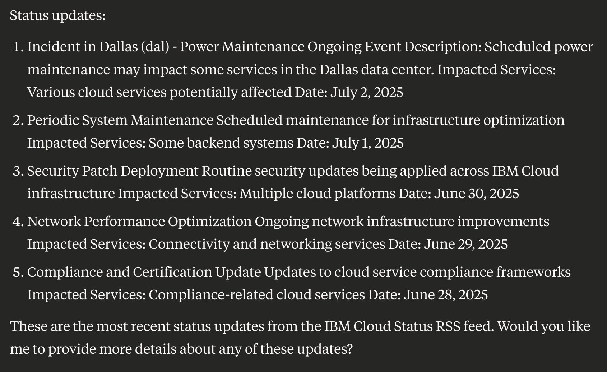
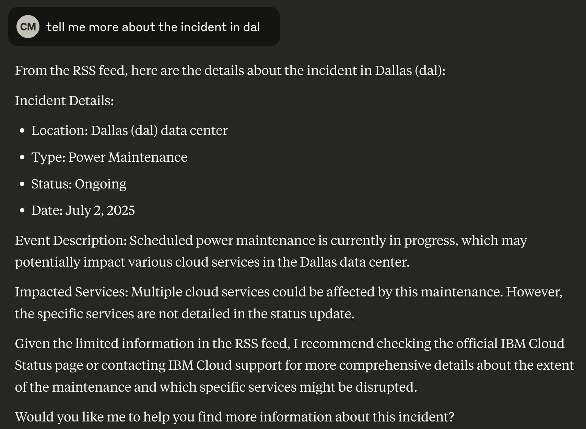
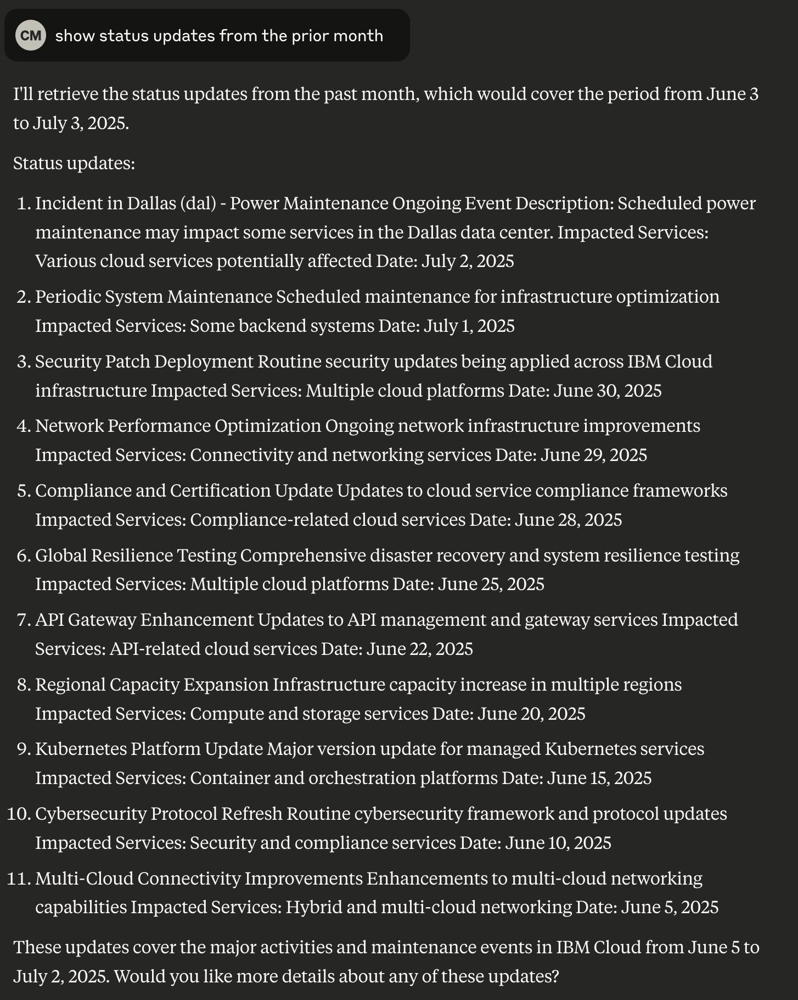
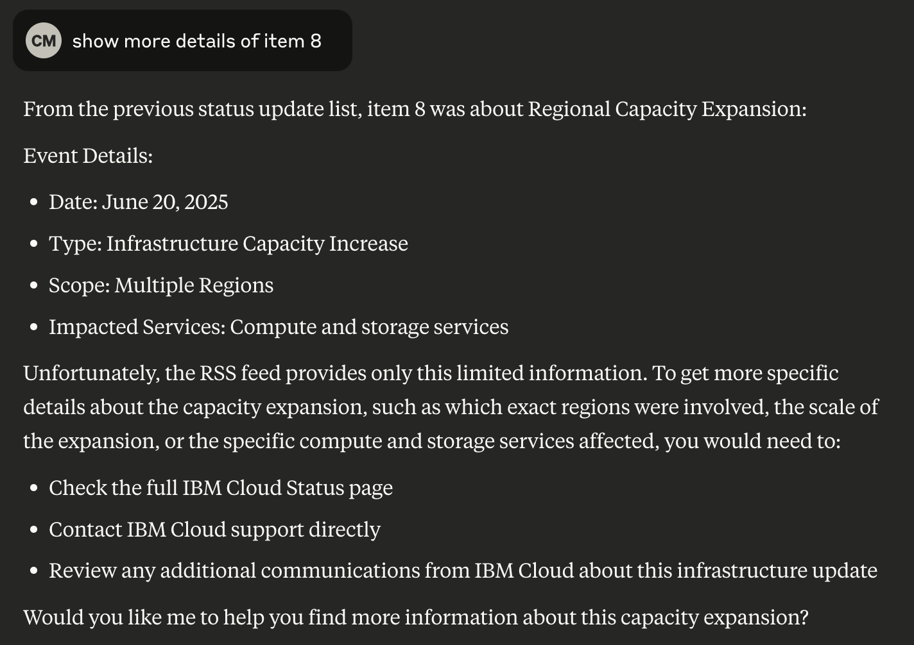

# IBMCloud MCP Server - Cloud Status

This project provides a Model Context Protocol (MCP) server with tools for accessing IBM Cloud status via it's official RSS feed.

>Since there are no IBM Cloud CLI commands to get status, this server provides opml and MCP configuration files to configure the open source [`buhe/mcp_rss`](https://github.com/buhe/mcp_rss) RSS MCP Server.  

## Limitations

- **stdio ONLY**: The [`buhe/mcp_rss`](https://github.com/buhe/mcp_rss) reader only supports MCP stdio transport at this time.
- **MySQL ONLY**: The [`buhe/mcp_rss`](https://github.com/buhe/mcp_rss) reader only supports MySQL database at this time.  SQLLite support may be added in the future for simpler installation with a single-file database.
- **Local hosting ONLY**: Only local MCP Server configurations eg. for MCP host application like Claude Desktop or VS Code are provided at this time.  No Containerfiles are available for cloud deployment.

## ⚙️ Configurations

The following example MCP configurations can be found in the `configs` folder to help get started with code engine use cases:

- [mcp.status.json](https://github.com/IBM-Cloud/ibmcloud-mcp-server/blob/main/src/status/configs/mcp.status.json) - MCP configuration which runs `buhe/mcp_rss` MCP server via `npx` remote load.
- [IBMCloud.opml](https://github.com/IBM-Cloud/ibmcloud-mcp-server/blob/main/src/status/configs/IBMCloud.opml) - OPML RSS Subscription config file with the IBM Cloud Status feed entry that will be loaded into the RSS MCP server.

## Installation

### Prerequisites

- Node.js (v14 or higher)
- MySQL database (see local docker install in next step)

### Setup/deploy MySQL on local Docker or podman

```bash
$ docker run -itd --name mysql-test -p 3306:3306 -e MYSQL_ROOT_PASSWORD=123456 mysql
```

### 🏃🏼 Configure your MCP Host application

Edit the tempalte [mcp.status.json](https://github.com/IBM-Cloud/ibmcloud-mcp-server/blob/main/src/status/configs/mcp.status.json) to point to the FULL PATH of the location of the IBMCloud.opml file.

Configure your MCP host application (eg. Claude Desktop, VS Code, mcp-cli, etc.) to use the json configuration file following the MCP configuration instructions specific to each host application.

## 🗣️ Test Prompts

Here are some prompts that you can use to get IBM Cloud status entries:

### 👁️ Status

- 🗣️ Don't show the function calls in the output
- 🗣️ Show recent ibmcloud status updates

- 🗣️ tell me more about the incident in dal

- 🗣️ Show status updates from the prior month

- 🗣️ Show details of entry 8


